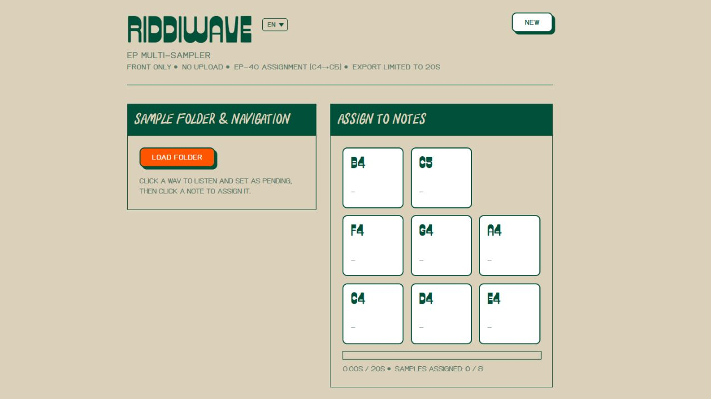
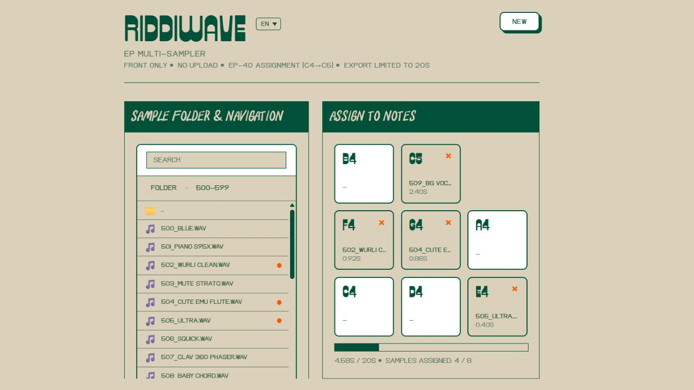
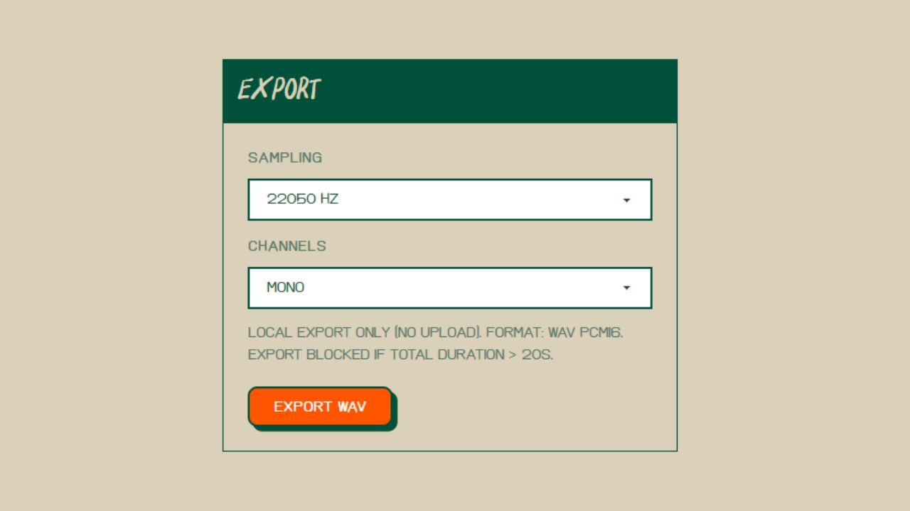

# Riddiwave - EP Multi-Sampler
## For direct use : https://www.kaitos.agency/tools/riddiwave-ep-multi-sampler/app



**Riddiwave** is a front-end web application for creating WAV multisamples compatible with Teenage Engineering's EP-40. The app allows you to load audio samples, assign them to MIDI notes (C4 to C5), and export a multisample WAV file - all without uploading data. Everything runs locally in your browser.

## 🎯 Features

- **Folder loading** : Load an entire folder of WAV files and navigate through them
- **Intuitive navigation** : Browse your folders and files with an integrated explorer
- **Audio preview** : Listen to your samples before assigning them
- **Visual assignment** : Assign your samples to MIDI notes (C4 → C5) via a visual keyboard
- **Local export** : Export your multisample as WAV PCM16 directly from your browser
- **Multilingual** : Interface available in FR, EN, ES, DE, JA
- **No upload** : All operations are performed locally, your files never leave your computer

## 📋 Requirements

- A modern web browser (Chrome, Firefox, Edge, Safari)
- WAV PCM files to assign
- No installation required - pure web application

## 🚀 Usage

### Step 1: Load a sample folder



1. Click the **"Load folder"** button in the "Sample folder & navigation" section
2. Select the folder containing your WAV files
3. The file explorer displays all your WAV files organized by folders

**Note** : Display is limited to 500 files for performance reasons.

### Step 2: Navigate and listen to your samples

- Use the **breadcrumb** at the top of the explorer to navigate between folders
- Click on a **WAV file** to:
  - Listen to it immediately
  - Set it as pending for assignment
- Already assigned files are marked and can be reassigned

### Step 3: Assign a sample to a note

1. After clicking on a WAV file (step 2), the sample is pending
2. Click on a **MIDI keyboard note** (C4, C#4, D4, E4, F4, G4, A4, B4, or C5)
3. The sample is assigned to that note
4. The note changes appearance to indicate a sample is assigned
5. The sample appears in the "Samples assigned" list on the right

**Tip** : You can click on an already assigned note to replay the sample or replace it.

### Step 4: Manage your assignments

In the "Samples assigned" section:
- View all assigned samples with their note, filename, and duration
- Click the **"×"** button to remove a sample from a note
- Total duration is displayed at the bottom (20 second limit)

### Step 5: Export your multisample



1. Make sure you have assigned at least one sample
2. Configure export settings:
   - **Sampling** : Choose the sample rate (e.g., 22050 Hz, 44100 Hz)
   - **Channels** : Mono or Stereo
3. Click **"Export WAV"**
4. The file is automatically downloaded to your downloads folder

**Limitations** :
- Total duration must not exceed **20 seconds**
- If the limit is exceeded, export is blocked with an error message
- Output format: WAV PCM16

## 🎹 Supported MIDI Notes

The application supports assignment on the following notes (EP-40 compatible):
- **C4** (Middle C)
- **C#4** (C#4)
- **D4** (D4)
- **E4** (E4)
- **F4** (F4)
- **G4** (G4)
- **A4** (A4)
- **B4** (B4)
- **C5** (C5)

## 📁 File Formats

### Input Files
- **Format** : WAV PCM only
- **Sample Rate** : All samples must have the same sample rate (will be automatically converted during export)
- **Channels** : Mono or Stereo accepted

### Output File
- **Format** : WAV PCM16
- **Structure** : Multisample with metadata for EP-40 compatibility
- **Limit** : Maximum 20 seconds total duration

## 🔧 Development

### Installation

```bash
cd ridiwave-web
npm install
```

### Local Development

```bash
npm run dev
```

The application will be available at `https://www.kaitos.agency/tools/riddiwave-ep-multi-sampler/app`

### Production Build

```bash
npm run build
```

Production files will be in the `dist/` folder

### Preview Build

```bash
npm run preview
```

## 🌍 Supported Languages

The interface is available in the following languages:
- 🇫🇷 French (FR)
- 🇬🇧 English (EN)
- 🇪🇸 Spanish (ES)
- 🇩🇪 German (DE)
- 🇯🇵 Japanese (JA)

Change the language via the selector at the top right of the title.

## ⚠️ Known Limitations

- Total duration limited to 20 seconds
- Display limited to 500 files in the explorer
- WAV PCM format only (no MP3, FLAC, etc.)
- Compatible with modern browsers only

## 🐛 Troubleshooting

### "No .wav files found in this folder"
- Check that the folder contains `.wav` files
- Files must be in WAV PCM format

### "Export impossible: total duration exceeds 20 seconds"
- Remove some samples or use shorter samples
- The 20 second limit is an EP-40 constraint

### "Export impossible: no samples assigned"
- Assign at least one sample to a note before exporting

### Audio player not working
- Check that your browser supports audio playback
- Try with another browser

## 📝 Technical Notes

- **Framework** : React + TypeScript + Vite
- **Audio** : Web Audio API for playback and processing
- **Storage** : No server required, everything works client-side
- **Compatibility** : Optimized for Teenage Engineering EP-40

## 📄 License

This project is developed by Kaitos Agency.

## 🤝 Contributing

Contributions are welcome! Feel free to open an issue or pull request.

---

**Riddiwave** - Create your EP-40 multisamples directly from your browser 🎵
